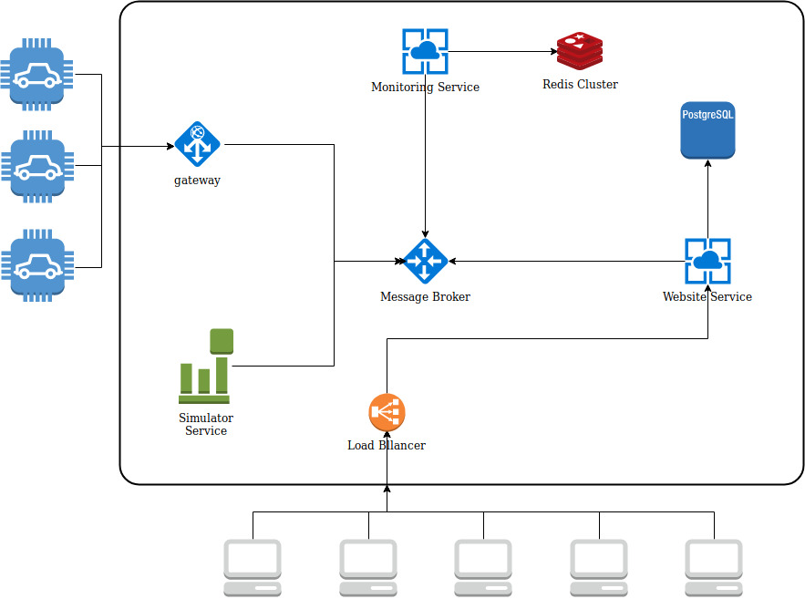

# Vehicles-Monitor
A distributed system to monitor vehicles status.

## Technology stack
* [Nameko](https://nameko.readthedocs.io/en/stable/) microservices framework
* [RabbitMQ](https://www.rabbitmq.com/) message broker
* [Redis](https://redis.io/) in-memory database
* [PostgreSQL](https://www.postgresql.org/) relational database
* [Django](https://www.djangoproject.com/) web framework
* [Docker](https://www.docker.com/) container framework

## How to run
To run the full system just use `docker-compose`:
```bash
docker-compose up 
```

for steps to run each component separately please see the docs of each component  

## Problem definition

You are working to company which has a number of vehicles belongs to a number of customer, 
They have a need to be able to view the status of the connection among these vehicles on a monitoring display
The vehicles send the status of the connection one time per minute. The status can be compared with 
a ping; no request from the vehicle means no connection so vehicle is either Connected or Disconnected.

## Architecture



This solution is composed of three main components  
* **[Monitoring Service](monitor/README.md):**  
A service is responsible for:  
    1- Receives a ping from the vehicle (or the simulator)  
    2- Keeps the last up time for each vehicle in a redis db  
    3- Returns the vehicles ids with its state (whether seen in the last minute or not)
    
* **[Website Service](website/README.md):**
A service is responsible for serving the website and currently it has only 2 routes:  
    1- (/): serves the dashboard website containing a table of the vehicles and its state
    2- (/vehicles): a restful endpoint with no params returns the full list of vehicles and gets the status from the 
    monitoring service
    
* **[Simulator Service](simulator/README.md):**
This service is responsible for simulating pings from vehicles, eah minute this service sends ping to the monitoring 
service, it decides randomly if it will or wont send a ping for each vehicle

# Scalability
This solution is designed for scalability, each component can be horizontally scaled.

